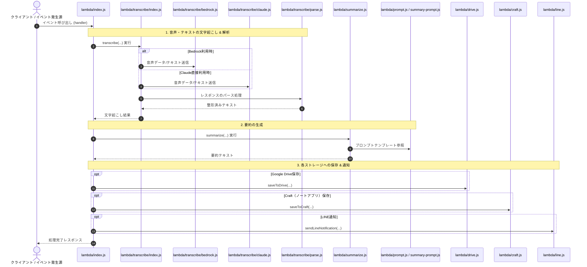

```mermaid
sequenceDiagram
    autonumber
    actor Client as クライアント / イベント発生源
    participant Index as lambda/index.js
    participant Transcribe as lambda/transcribe/index.js
    participant Bedrock as lambda/transcribe/bedrock.js
    participant Claude as lambda/transcribe/claude.js
    participant Parse as lambda/transcribe/parse.js
    participant Summarize as lambda/summarize.js
    participant Prompts as lambda/prompt.js / summary-prompt.js
    participant Drive as lambda/drive.js
    participant Craft as lambda/craft.js
    participant Line as lambda/line.js

    Client->>Index: イベント呼び出し (handler)
    
    note over Index, Parse: 1. 音声・テキストの文字起こし & 解析
    Index->>Transcribe: transcribe(...) 実行
    alt Bedrock利用時
        Transcribe->>Bedrock: 音声データ/テキスト送信
    else Claude直接利用時
        Transcribe->>Claude: 音声データ/テキスト送信
    end
    Transcribe->>Parse: レスポンスのパース処理
    Parse-->>Transcribe: 整形済みテキスト
    Transcribe-->>Index: 文字起こし結果

    note over Index, Prompts: 2. 要約の生成
    Index->>Summarize: summarize(...) 実行
    Summarize->>Prompts: プロンプトテンプレート参照
    Summarize-->>Index: 要約テキスト

    note over Index, Line: 3. 各ストレージへの保存 & 通知
    opt Google Drive保存
        Index->>Drive: saveToDrive(...)
    end
    opt Craft（ノートアプリ）保存
        Index->>Craft: saveToCraft(...)
    end
    opt LINE通知
        Index->>Line: sendLineNotification(...)
    end

    Index-->>Client: 処理完了レスポンス
```